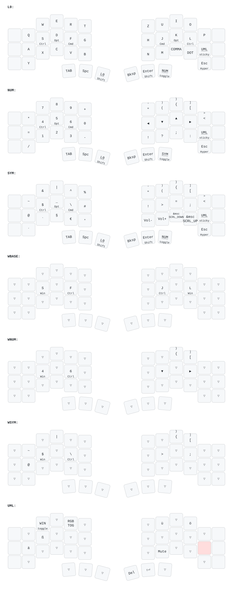

# Piantor Pro BT — ZMK config

Personal [ZMK](https://zmk.dev) firmware configuration for the
[Piantor Pro BT](https://keebart.com/products/piantor-wireless), a 42-key
wireless split keyboard, with nice!view displays and ZMK Studio support.

The keymap is designed for a **German (QWERTZ) host layout**, macOS-first,
with a toggleable Windows mode that patches the differences (AltGr symbol
codes, swapped Ctrl/Cmd home-row mods) via conditional layers.

## Keymap

Rendered automatically by [keymap-drawer](https://github.com/caksoylar/keymap-drawer)
on every push (see `.github/workflows/draw-keymaps.yml`).

### Layers

| # | Layer | Purpose |
|---|-------|---------|
| 0 | `L0` | QWERTY base with home-row mods (Ctrl/Opt/Cmd) and a sticky umlaut key |
| 1 | `NUM` | Numpad, arrow navigation, brackets (tap = opener, shift = closer via mod-morph) |
| 2 | `SYM` | Symbols tuned for C# and vim (literal `~` `^` `` ` `` via dead-key macros), media and scroll |
| 3 | `WIN` | Flag layer — toggles Windows mode |
| 4–6 | `WBASE` / `WNUM` / `WSYM` | Conditional overlays: Windows AltGr symbol codes and swapped GUI/Ctrl home-row mods |
| 7 | `UML` | Sticky overlay for German umlauts (ä ö ü ß) plus toggles for Windows mode, RGB and mute |

### Notable behaviors

- **Home-row mods** (`hml`/`hmr`): balanced flavor, `require-prior-idle-ms`,
  hold-trigger positions restricted to the opposite hand.
- **Backup shift on Enter** (`sent`): tuned so a mis-classified press yields
  Shift (harmless) instead of a premature Enter.
- **Bracket mod-morphs**: one key per bracket pair — tap for the opener,
  hold a thumb shift for the closer.
- **Literal `~` `^` `` ` ``**: macros that follow the German dead keys with a
  space, so vim motions and code work in one press.

## Building

Firmware is built by GitHub Actions on every push using the standard
[ZMK user-config workflow](https://zmk.dev/docs/user-setup). Download the
`firmware` artifact from the latest
[build run](https://github.com/Bennett5143/zmk-config/actions/workflows/build.yml).

## Flashing

1. Connect a half via USB and double-tap its reset button to enter the bootloader.
2. Copy the matching `piantor_pro_bt_left`/`..._right` `.uf2` file onto the
   USB drive that shows up; the board flashes and reboots automatically.
3. Repeat for the other half.

`settings_reset` firmware is also built for clearing pairing data if the
halves stop talking to each other.

## Credits & license

Based on [Keebart's zmk-config](https://github.com/Keebart/zmk-config) for the
Piantor Pro BT, which provides the board definition under `boards/arm/`.
Licensed under the [MIT license](LICENSE).
